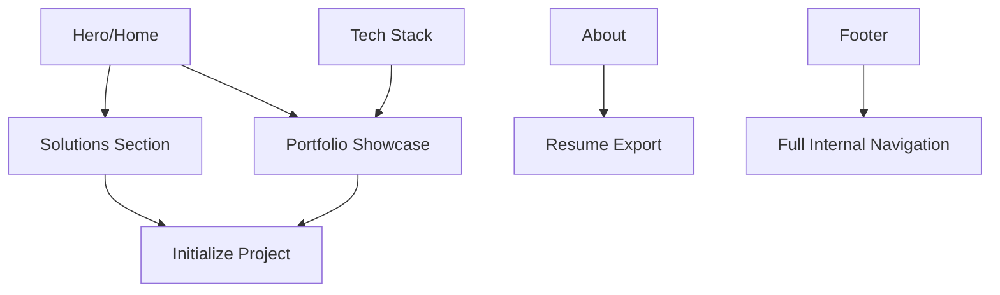

# Portfolio SEO Strategy & Keyword Map (2025)

This document outlines the strategic SEO architecture implemented for the Mahmudul Hassan portfolio to ensure maximum visibility for high-intent professional services.

## 1. Targeted Keyword Ecosystem

| Priority | Category | Main Keywords | Semantic Variations |
| :--- | :--- | :--- | :--- |
| **P0** | AI Automation | AI Automation Agency, AI Systems Architect | Autonomous Agents, Workflow Automation, n8n Expert |
| **P1** | SaaS Engineering | Next.js Full-Stack Developer, SaaS MVP Build | React 19, TypeScript Engineer, Scalable Web Apps |
| **P2** | Specialized Tech | Supabase Expert, Headless E-commerce | Jamstack, API-First Design, AI Agent Engineering |

## 2. Semantic Content Hierarchy

We maintain a strict 1-2-3 depth for all pages to ensure Google's "Search Generative Experience" (SGE) and LLM crawlers can accurately parse the site's authority.

- **H1**: Global Identity (e.g., "AI Automation Architect").
- **H2**: Section Headers (Services, Projects, Tech, About).
- **H3**: Component/Card Titles (Individual service types, project names).
- **H4**: Bullet point emphasis or sub-details.

## 3. Internal Linking Architecture

## 4. On-Page Optimization Standards

- **Images**: All assets use `alt` tags following the pattern: `[Name] — [Role] - [Action/Context]`.
- **Aria Labels**: Every interactive element (buttons, social icons, links) has a unique, descriptive label.
- **JSON-LD**: Embedded `ProfessionalService` and `Person` schemas in `layout.tsx`.

## 5. Maintenance & Growth Plan

1. **Monthly Audit**: Check Lighthouse SEO score (Aim: 100/100).
2. **Backlink Strategy**: Leverage Open Source contributions on GitHub to drive domain authority.
3. **Content Expansion**: Future-proof for a "Blog/Case Study" section using Markdown files.

---
*Last Updated: April 2026*
